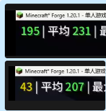

# VMD Animation Cache

<div align="center">


**Per-frame cache for SlashBlade VMD animation MMD computation.**

</div>

---

## Overview

When using [SlashBlade Resharped](https://www.curseforge.com/minecraft/mc-mods/slashblade-resharped), MMD-based blade animations are rendered by computing the full MMD motion pipeline — VMD parsing, bone motion interpolation, and skinning matrix transformation — for every bone, every time a transform is queried.

**VMD Animation Cache** eliminates this redundant computation by caching the result per frame, giving a **2.5× FPS improvement** in third-person view when SlashBlade entities are visible.

## The Problem

`VmdAnimation.setupAnim(float partialTick)` is called every time a bone transform is needed during rendering. Here's what happens on each call:

1. `setVmd()` — parse VMD motion data
2. `updateMotion()` — interpolate bone keyframes for the current tick
3. Compute skinning matrices for the bone

With MMD models containing **30–60 bones**, and each bone queried **twice** (once for `POSITION`, once for `BEND`), `setupAnim` is invoked **60–120 times per entity per frame**. All of these calls produce identical results within a single frame — the tick and partial tick don't change. This burns ~20% of the Render thread budget.

## The Solution

A single Mixin injects into `VmdAnimation.setupAnim` at the head. It caches the `(currentTick, partialTick)` pair:

- **Cache hit** (same tick + partial as last call): cancel the method entirely — zero work
- **Cache miss** (new tick or partial): update the cache and let the method run

This reduces **120 O(N²) calls to 1 O(N) call** per entity per frame.

## Performance

| Scenario | Before | After |
|----------|--------|-------|
| Third-person FPS (SlashBlade visible) | ~100 | ~250 |

Measured on Minecraft 1.20.1 with SlashBlade Resharped 1.9.65, single SlashBlade entity in view.



## Installation

### Requirements

| Dependency | Version |
|------------|---------|
| Minecraft | 1.20.1 |
| Forge | 47+ |
| [SlashBlade Resharped](https://www.curseforge.com/minecraft/mc-mods/slashblade-resharped) | 1.9.65 |

### Install

1. Download `vmdcache-1.0.0.jar` from [Releases](https://github.com/huanghuang/vmdcache/releases)
2. Place it in your `mods/` folder
3. Launch the game

## Compatibility

> **Warning:** Do not use together with **AntiEntropyCore** — both mods inject into the same Mixin target class (`VmdAnimation`) and will conflict.

## Building from Source

```bash
# 1. Place SlashBlade Resharped in libs/
mkdir -p libs
cp /path/to/SlashBladeResharped-1.20.1-1.9.65.jar libs/

# 2. Build
./gradlew build

# Output: build/libs/vmdcache-1.0.0.jar
```

### Development Setup

```bash
# Generate IDE run configurations
./gradlew genEclipseRuns    # Eclipse
./gradlew genVSCodeRuns     # VS Code
./gradlew genIntellijRuns   # IntelliJ IDEA
```

## How It Works

```
Render Frame
  ├─ Bone #0 POSITION  → setupAnim(tick=42, partial=0.3) ← CACHE MISS, run pipeline
  ├─ Bone #0 BEND      → setupAnim(tick=42, partial=0.3) ← CACHE HIT, skip
  ├─ Bone #1 POSITION  → setupAnim(tick=42, partial=0.3) ← CACHE HIT, skip
  ├─ Bone #1 BEND      → setupAnim(tick=42, partial=0.3) ← CACHE HIT, skip
  ├─ ...
  └─ Bone #59 BEND     → setupAnim(tick=42, partial=0.3) ← CACHE HIT, skip  (119 skips)

Next Frame
  ├─ Bone #0 POSITION  → setupAnim(tick=42, partial=0.7) ← CACHE MISS, run pipeline
  └─ ...
```

The Mixin targets `VmdAnimation.setupAnim`, the sole entry point for bone transform computation. By intercepting at `@At("HEAD")`, we bypass the entire method before any work is done.

## Technical Details

- **Mixin config:** `vmdcache.mixins.json`
- **Target class:** `mods.flammpfeil.slashblade.compat.playerAnim.VmdAnimation`
- **Injection point:** `HEAD` of `setupAnim(float)`
- **Remap:** `false` (target mod is not obfuscated)
- **Side:** Client only

## License

MIT © 2025 huanghuang
